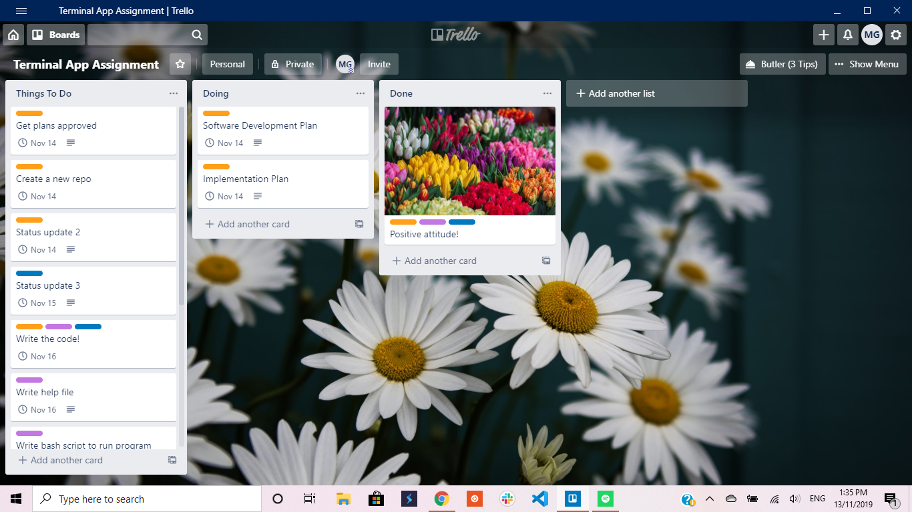

### 14/11/2019

* Created a new repository at github and completed 5 or 6 pushes
* Wrote software development plan outlining program features and got the plan approved by teacher
* Wrote a class file with class methods
* Wrote program code using loops, methods and gems
* Created development-log file

.png)

### 15/11/2019

* Implemented error handling inside a class method
* Made an array for colour selection to avoid repetition in a code
* Wrote a test for class method
* Corrected date and time format for a class method
* Implemented use of ARGV 

.png)
.png)

### 16/11/2019

* Wrote user interaction plan
* Wrote Help plan 
* Completed software implementation plan
* Saved a flowchart

.png)
.png)